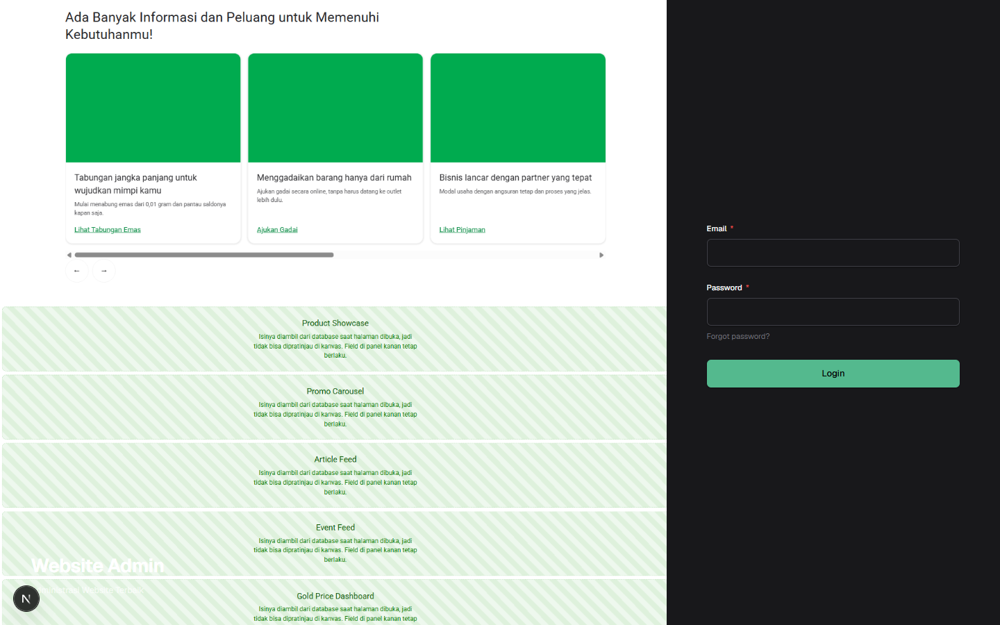
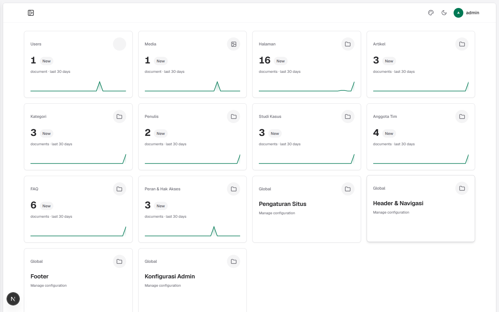
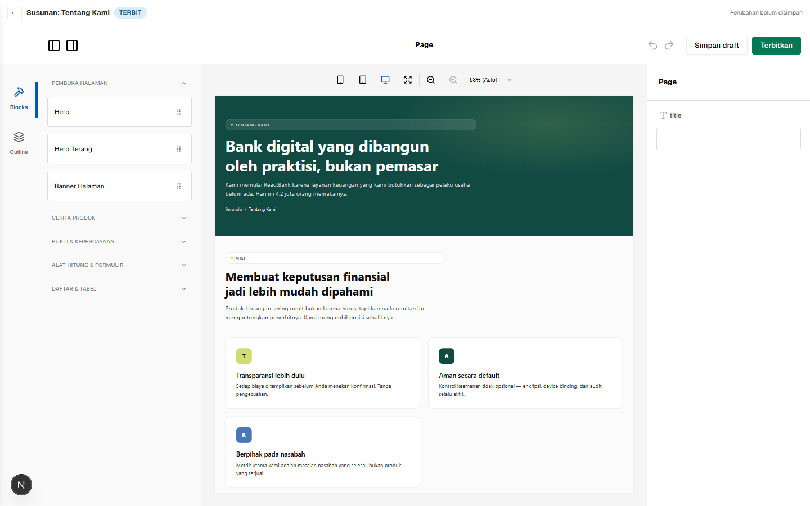

# Payload Boilerplate

A Payload CMS 3 starter wired for a **decoupled frontend**: the CMS owns the
content and the block definitions, a separate Next.js application renders them,
and the two run on different origins and talk over the REST API.


<p>
  
  
  
  
  
  
  
  
</p>

---

## ⚠️ This repository is not self-contained

The CMS imports the block component map and the site content from a sibling
frontend directory through the `@fe/*` alias, and its Turbopack root is the
parent folder. Cloning this repository on its own gives you a project that
**will not start** — `pnpm dev` and `pnpm build` both fail while resolving
`@fe/blocks/registry`.

That is a deliberate consequence of a design decision, not an oversight. The
block map lives in the frontend because the components do. Keeping a second copy
here would mean two lists that must be kept identical by hand, and the one that
drifts first is always the one nobody opens.

To run it you need this layout:

```
your-workspace/
├── payload-boilerplate/     ← this repository
└── NEXT-REACTBANK/          ← the frontend (separate)
```

Expected by `tsconfig.json`:

```jsonc
"paths": { "@fe/*": ["../NEXT-REACTBANK/src/*"] }
```

---

## What you get

| | |
| --- | --- |
| **39 blocks** | Page sections defined in Payload, rendered by frontend components |
| **9 collections** | Users, Media, Pages, Posts, Categories, Authors, Case Studies, Team, FAQ |
| **3 globals** | Site Settings, Header & Navigation, Footer |
| **Visual editing** | Puck canvas that renders the real production components |
| **Cross-origin** | CORS, CSRF, and Live Preview across two domains |
| **44 tests** | 38 Playwright end-to-end, 6 Vitest integration |

### Admin panel

The theme, navigation groups, dashboard cards, and login screen are all editable
from the panel itself — no redeploy to change a colour or a logo.

| Login | Dashboard |
| --- | --- |
|  |  |

### Page editing, two ways

Blocks are added and edited in Payload's own form, or arranged visually in Puck.
Both read and write the **same** `layout` array — there is no second store and no
second catalogue. The Puck field panel is derived from the Payload block
definitions at runtime, so adding a field in one place makes it appear in the
other.

| Payload form | Puck canvas |
| --- | --- |
|  |  |

The catalogue on the left is grouped by where a block belongs in a page — opener,
product story, proof, tools, lists — because thirty-nine items in one flat list
is a scroll with no visible boundaries.

### Frontend

Every content page is a `pages` document. Nothing about `/about-us`,
`/services`, or `/platform` lives in a route file any more.


---

## Plugins

All three are published to npm and maintained in their own repositories.

| Plugin | Version | What it does |
| --- | --- | --- |
| [payload-admin-theme](https://github.com/rhyoharianja/payload-admin-theme) · [npm](https://www.npmjs.com/package/payload-admin-theme) | 1.1.0 | Admin theme, navigation, dashboard, and login screen — all configurable from the panel, applied on save |
| [payload-puck-advance](https://github.com/rhyoharianja/payload-puck-advance) · [npm](https://www.npmjs.com/package/payload-puck-advance) | 0.3.1 | Puck canvas driven by Payload block definitions, honouring drafts, versions, and access control |
| [payload-hrbac](https://github.com/rhyoharianja/payload-hrbac) · [npm](https://www.npmjs.com/package/payload-hrbac) | 1.0.0 | Dynamic nested RBAC — roles, inheritance, and per-field read/write permissions |

---

## Setup

**Requirements:** Node 20+, pnpm 10+, PostgreSQL 14+ (Docker is fine), and the
frontend checked out as a sibling directory.

```bash
pnpm install
cp .env.example .env      # then fill in DATABASE_URL and PAYLOAD_SECRET
pnpm seed:admin           # creates the first admin user
pnpm dev                  # http://localhost:3001/admin
```

The schema is pushed automatically in development. Once the admin panel answers,
seed the content:

```bash
pnpm seed:content
```

`seed:content` is **idempotent**: existing documents are left alone, and only
fields that are still empty get filled. Pass `SEED_PAGES_FORCE=1` to overwrite
page layouts with the defaults — it discards edits, so it exists for the case
where the shipped layout changed and seeded pages need to follow.

### Environment

Both origins have to know about each other. The names that matter:

| Variable | Why |
| --- | --- |
| `DATABASE_URL` | PostgreSQL connection |
| `PAYLOAD_SECRET` | Signing key — `openssl rand -hex 24` |
| `FRONTEND_URL` | Read on the **server**: CORS allowlist, Live Preview target, cache purge |
| `NEXT_PUBLIC_FRONTEND_URL` | Read in the **browser** by the Puck canvas to load frontend styles |
| `REVALIDATE_SECRET` | Shared secret for the purge endpoint. Without it revalidation is **disabled** — an unauthenticated purge endpoint is one anybody can hammer |

---

## Scripts

| Script | |
| --- | --- |
| `pnpm dev` | Development server on `:3001` |
| `pnpm build` | Production build |
| `pnpm seed:admin` | Create the first admin user |
| `pnpm seed:content` | Fill collections, globals, and pages |
| `pnpm rbac:init` | Create the default roles |
| `pnpm generate:types` | Regenerate `payload-types.ts` |
| `pnpm generate:importmap` | Regenerate the admin import map |
| `pnpm test:int` | Vitest integration tests |
| `pnpm test:e2e` | Playwright end-to-end tests |
| `pnpm lint` | ESLint |

### Running the tests

The end-to-end suite drives real browsers against both running applications, so
start the CMS and the frontend first:

```bash
CMS_URL=http://localhost:3001 FRONTEND_URL=http://localhost:3030 pnpm test:e2e
```

What it guards is deliberately narrow: the things that have actually broken
before. The Puck canvas must load stylesheets from the **frontend** origin and
not the CMS; the block catalogue must list exactly the registered blocks;
dragging one onto the canvas must add it; Live Preview must display a
cross-origin iframe; and changing a document in the CMS must change the page.

That last one matters more than it looks. Seeded content is identical to the
static content it replaced, so every page still renders correctly even if the
connection to the CMS is severed completely. Asserting "the page has content"
would pass in exactly the situation worth catching — so the tests change a
value through the API and then check that the change appears.

To refresh the screenshots in this README:

```bash
CAPTURE_SCREENSHOTS=1 pnpm exec playwright test tests/e2e/screenshots.e2e.spec.ts
```

---

## How it fits together

**Blocks are defined once, in Payload.** `src/blocks/reactbank/` holds the field
definitions; the frontend holds the components. They meet on the block `slug`,
and an integration test fails the build if the two lists ever diverge.

**The Puck canvas renders the production components**, not a preview
approximation, and borrows the frontend's stylesheet at runtime. Because the two
run on different origins, every stylesheet href has to be resolved against the
frontend origin before it is injected — a relative href resolves against the CMS
and 404s, leaving an unstyled canvas with no error anywhere.

**Business rules stay in code.** The blocks expose copy and starting values;
instalment formulas, eligibility thresholds, and form steps do not. Moving those
into the CMS would mean storing a program inside a document, and anyone who can
edit a page could change who qualifies for credit.

**Unknown blocks fail soft.** The CMS and the frontend are separate deploys, so
an older frontend will receive a newer block at some point. Losing one block is
much cheaper than collapsing the page.

---

## Author

**Suryo Galih Kencana Harianja** — <harianja.suryo@gmail.com>

If this saved you time:

[](https://www.paypal.com/paypalme/sgkharianja)
[](https://saweria.co/rhioharianja)

## Licence

MIT
